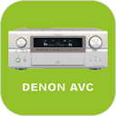

Plugin Denon AVC (DenonAVC)
===========================

Plugin pour commander les ampli Denon série AVC via Jeedom.

> **Note**  
> Ce plugin a été développé car le plugin officiel (denonavr) ne fonctionnait pas sur mon ampli
> Il exploite l'interface web.

**Fonctionnalités :**

- Allumer / éteindre,
- Changer d'entrée,
- Contrôler le volume et activer/désactiver mute,

**Modèles compatibles**
- Denon AVC A11XV
- Probablement d'autres modèles Denon

Dashboard
=======================

Configuration du plugin
=======================

Après téléchargement du plugin, activer le plugin.

Configuration des équipements
=============================

La configuration des équipements Denon est accessible à partir du menu *Plugins > Multimedia > Denon AVC Amplificator*.

### Onglet Equipement:

-   **Nom de l’équipement Denon** : nom de votre équipement (ex A11XV),
-   **Objet parent** : indique l’objet parent auquel appartient
    l’équipement,
-   **Catégorie** : les catégories de l’équipement (il peut appartenir à
    plusieurs catégories),
-   **Activer** : permet de rendre votre équipement actif,
-   **Visible** : rend votre équipement visible sur le dashboard,
-   **Adresse IP** : Adresse IP de l’ampli.
-   **Sources** : Liste des sources à afficher sur la tuile

### Onglet Commandes

Les commandes de bases sont générées automatiquement 

